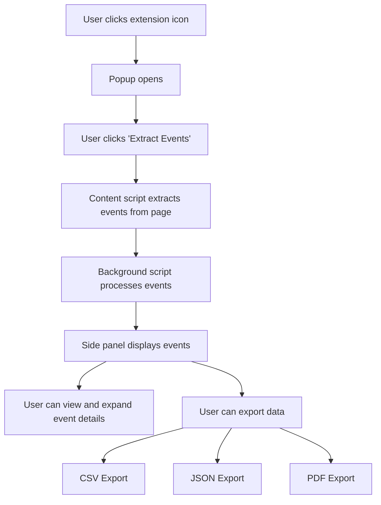

# Event Extractor Chrome Extension

## Overview

The Event Extractor is a Chrome extension designed to scrape past event details from Meetup.com pages, display them in a side panel, and allow users to export the data in various formats (CSV, JSON, and PDF).

Key features:

- Extracts past event information from Meetup.com pages
- Displays extracted data in a collapsible side panel
- Allows exporting of event data in CSV, JSON, and PDF formats

## How It Works

1. The user clicks the extension icon and then the "Extract Events" button in the popup.
2. The content script extracts past event information from the current Meetup.com page.
3. The background script processes this information, opening each event link in a background tab to extract additional details.
4. The side panel displays the extracted events in a collapsible list.
5. Users can view event details and export the data in various formats.

## Loading the Extension in Chrome (Developer Mode)

To load the extension in Chrome using Developer Mode:

1. Open Google Chrome and navigate to chrome://extensions.
2. In the top right corner, toggle on "Developer mode".
3. Click on "Load unpacked" in the top left corner.
4. Navigate to the directory containing the extension files and select it.
5. The extension should now appear in your list of installed extensions and in the Chrome toolbar.

## Disclaimer

This extension is provided for educational and personal use only. Use it at your own risk. The developers are not responsible for any misuse or any consequences arising from the use of this extension. Always respect website terms of service and be mindful of data usage and privacy concerns when scraping information from websites.

Favicon for extension: <a href="https://www.flaticon.com/free-icons/extraction" title="extraction icons">Extraction icons created by Iconjam - Flaticon</a>

## License

This project is open source and available under the MIT License.
